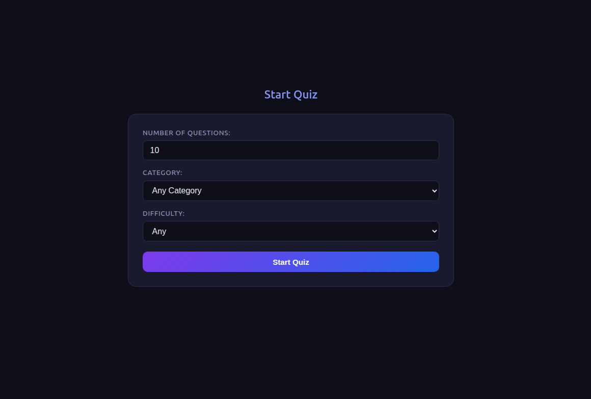

# 🎯 Quiz App

A clean, interactive trivia quiz app built with **vanilla JavaScript** — no frameworks, no libraries. Questions are fetched live from the [Open Trivia Database](https://opentdb.com/) API.



🔗 **[Live Demo](https://nwntaspap.github.io/Quiz-App)**

---

## Features

- 🗂️ 25+ trivia categories to choose from
- ⚙️ Configurable number of questions (1–50)
- 🎚️ Three difficulty levels: Easy, Medium, Hard
- ✅ Instant answer feedback with color highlights
- 📊 Score tracking and results screen
- 🔄 Restart or change settings without reloading the page

---

## Tech Stack

|                |                                              |
| -------------- | -------------------------------------------- |
| **Language**   | Vanilla JavaScript (ES Modules)              |
| **API**        | [Open Trivia Database](https://opentdb.com/) |
| **Linting**    | ESLint                                       |
| **Formatting** | Prettier                                     |
| **Hosting**    | GitHub Pages                                 |

---

## Project Structure

```
Quiz-App/
├── index.html
├── styles.css
└── src/
    ├── app.js          # Entry point & quiz flow
    ├── state.js        # Global state management
    ├── ui.js           # DOM rendering
    ├── api.js          # API calls & data normalization
    └── categories.js   # Category list
```

---

## Getting Started

No build step needed — just clone and open in a browser.

```bash
# Clone the repo
git clone https://github.com/nwntaspap/Quiz-App.git
cd Quiz-App
```

Then open `index.html` directly, or serve it with any static server:

```bash
# Using VS Code: install the Live Server extension and click "Go Live"
# Or with Node.js:
npx serve .
```

---

## How It Works

1. Choose your **category**, **difficulty**, and **number of questions**
2. Hit **Start Quiz** — questions are fetched live from the API
3. Pick an answer — correct ones turn green, wrong ones turn red
4. Hit **Next** to advance through the quiz
5. See your final score and restart or change settings

---

## License

ISC
